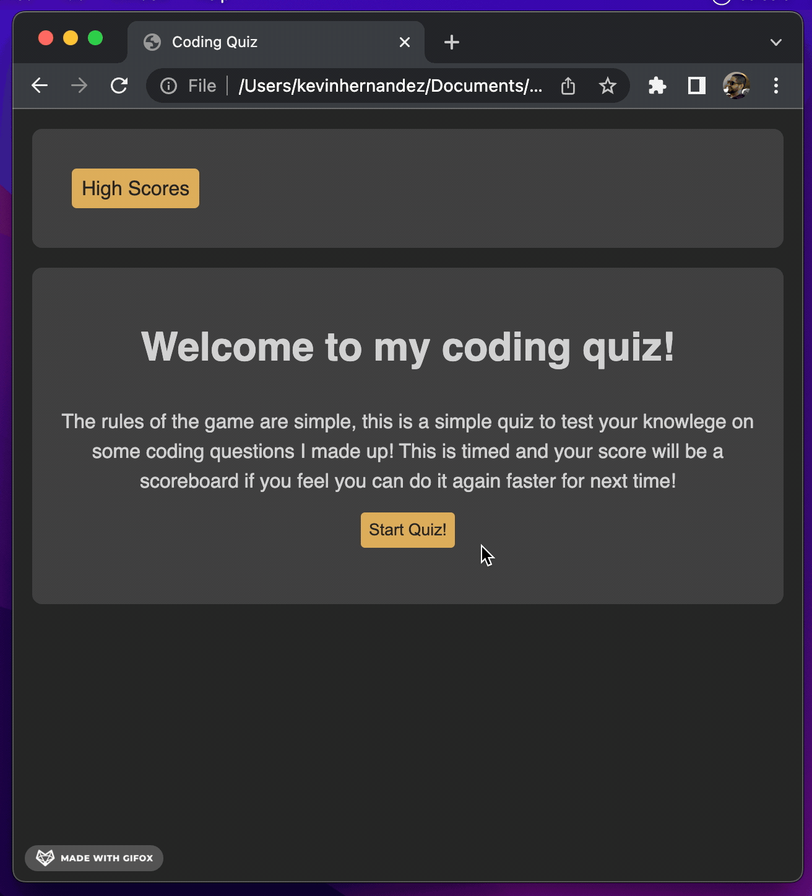
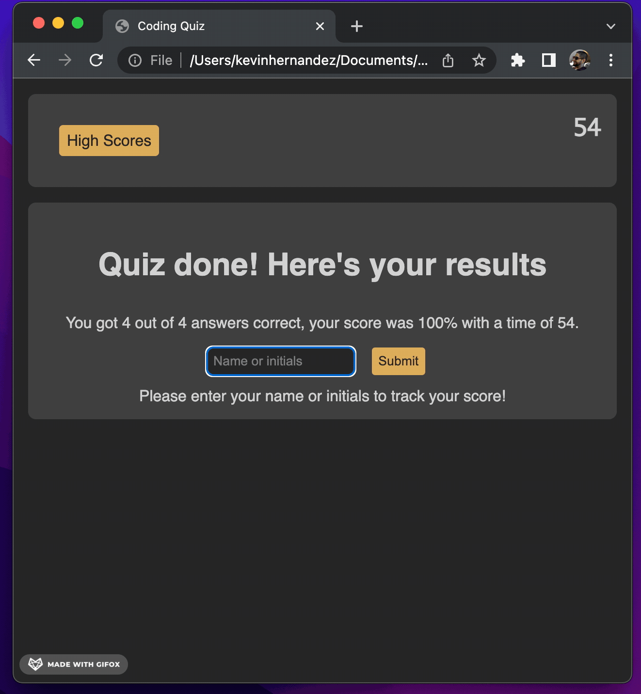

# Coding Quiz

<h1>This is my coding quiz!</h1>
 
This is a timed quiz has 4 questions and is a demonstration for changing the page upon button presses. Once completing the quiz, you can save your score, time, and name in the browser's local storage.

 
<ul>
<li>Dynamically update the html file upon button presses</li>
<li>Save data onto the browser using local storage</li>
<li>Clear the browser's local storage for this page</li>
</ul>

Example of the page:

Check it out!

https://kh288.github.io/Coding-Quiz/